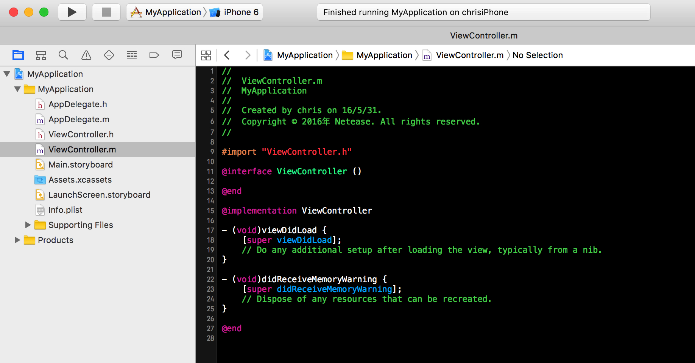
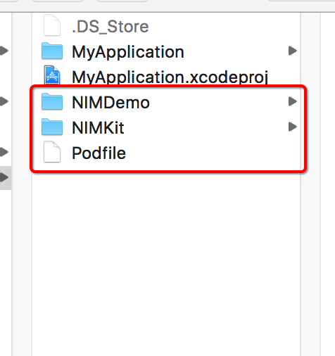
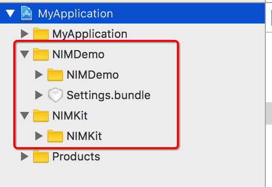
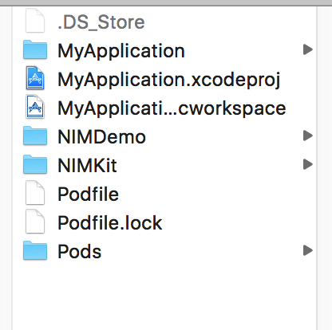

# 网易云信 Demo

##网易云信介绍

网易云信是由网易提供的通讯云服务，仅用一天就能让你的 APP 实现 IM 功能。本 demo 为网易云信的 iOS 端 demo。

##项目构建

* 进入NIMDemo目录，使用 **pod install** 命令下载依赖并生成 **NIM.xcworkspace**.
* 打开 **NIM.xcworkspace** 编译即可


##Demo登录
支持以下三种方式登录

1. 通过Demo直接注册并登录。
2.   通过[云信后台](https://app.netease.im/login) 建立管理帐号。
   * 登录管理帐号，并创建 demo 帐号 (推荐至少创建两个)。
   * 使用 demo 账号进行登录。

3. 使用如下测试帐号进行登录:


| 帐号      | 密码           | 
| ------------- |:-------------:| 
| githubtest1 | 123456 | 
| githubtest2 | 123456      |
| githubtest3 | 123456      |  
| githubtest4 | 123456     |  
| githubtest5 | 123456       |  


##在原有工程里移植 Demo
本教程将在一个只有单页面的简单工程里做演示，工程支持 iOS7.0 以上系统，仅供参考。此教程依赖 `CocoaPods`，具体请参考 [CocoaPods 官方网站](https://cocoapods.org/)。

*  原有工程示例如图。
   
   
   
*  在工程配置 `info.plist` 文件中，添加条目 `NSAppTransportSecurity` ，属性设为 `Dictionary` 。在此条目下添加键值对，key 为 `NSAllowsArbitraryLoads`, 值为 `YES`。

*  **将 Demo 的 NIM 和 NIMKit 工程的 xcodeproj 文件删除。**
*  **将 Demo 的 main.m 文件删除。**
*  将 Demo 中所有文件移入工程，并在自己工程中添加。如图所示

   

   

*  修改 Podfile 文件如下
   
   ```
   platform :ios, '7.0'
		pod 'SDWebImage', '~> 3.7.1'
		pod 'Toast', '~> 2.4'
		pod 'SVProgressHUD', '~> 1.1.2'
		pod 'M80AttributedLabel', '~> 1.3.1'
		pod 'AFNetworking', '~> 2.5.1'
		pod 'FMDB', '~> 2.5'
		pod 'Reachability', '~> 3.1.1'
		pod 'CocoaLumberjack', '~> 2.0.0-rc2'
		pod 'NIMSDK'
		pod 'ZipArchive', '~> 1.4.0'
   ```
*  终端进入工程根目录执行命令 `pod install` ，完成后工程如图

   

*  点击 `MyApplication.xcworkspace` 进入工程（**注意不是 MyApplication.xcodeproj**）。 编译运行，会发现有一些报错，找不到头文件。这是因为在原来的 NIM 和 NIMKit 工程中，使用了预编译文件。您可以逐个在报错的地方引入头文件，也可以自行制作一个预编译头文件（会在一定程度上降低您的编译速度）。

*  预编译示例：
   *  在工程中新建预编译文件 `Application-prefix.pch`，文件内容如下
   
	   ```
		    #ifndef Application_prefix_h
			#define Application_prefix_h

			#ifdef __OBJC__
			#import <UIKit/UIKit.h>
			#import <Foundation/Foundation.h>
			#import "NIMSDK.h"
			#import "NTESGlobalMacro.h"
			#import "NIMKit.h"

			#import <CocoaLumberjack/CocoaLumberjack.h>

			#ifdef DEBUG
			static DDLogLevel ddLogLevel = DDLogLevelVerbose;
			#else
			static DDLogLevel ddLogLevel = DDLogLevelInfo;
			#endif

			#define NTES_USE_CLEAR_BAR - (BOOL)useClearBar{return YES;}

			#define NTES_FORBID_INTERACTIVE_POP - (BOOL)forbidInteractivePop{return YES;}


			#endif
			#endif
	   ```
	
  *  在工程配置，`Build Settings` 选项卡中，找到 `Prefix Header` 选项，填入预编译文件的**真实路径**,如 `$(PROJECT_DIR)/MyApplication/NIMDemo-Prefix.pch`，**注意此路径和预编译文件的实际路径必须匹配，请自行检查。**

* Clean 工程，再次编译，将编译成功，如果报错请自行检查上述步骤。
* 将 ViewController.m 里代码替换成以下内容，并在 xib 上构造按钮连接 `	- (IBAction)enterIm:(id)sender` 点击事件。

  ```objc
	#import "ViewController.h"
	#import "NTESLoginViewController.h"
	#import "NTESDemoConfig.h"
	#import "NTESCustomAttachmentDecoder.h"

	@interface ViewController ()

	@end

	@implementation ViewController

	- (void)viewDidLoad {
	    [super viewDidLoad];
	    [[NIMSDK sharedSDK] enableConsoleLog];
	    NSString *appKey = [[NTESDemoConfig sharedConfig] appKey];
	    NSString *cerName= [[NTESDemoConfig sharedConfig] cerName];
	    [[NIMSDK sharedSDK] registerWithAppID:appKey
	                                  cerName:cerName];
	    [NIMCustomObject registerCustomDecoder:[NTESCustomAttachmentDecoder new]];

	}

	- (IBAction)enterIm:(id)sender
	{
	    NTESLoginViewController *vc = [[NTESLoginViewController alloc] initWithNibName:nil bundle:nil];
	    [self presentViewController:vc animated:YES completion:nil];
	}
	@end
  ```
  
* 至此，简单的集成工作就做完了，UI 上显示还会有一些异常，具体指南请参考。[云信iOS UI 组件](https://github.com/netease-im/NIM_iOS_UIKit)
* 移植的示例 Demo 请点击[这里](/Resource/MyApplication)。在使用前请先在根目录执行命令 `pod install`。